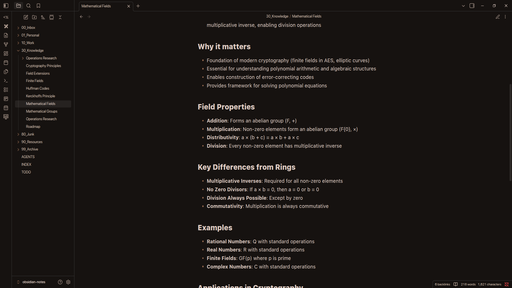

# Vesper-Sandstorm

A minimal Obsidian theme combining Vesper's structure with Sandstorm's warm brown palette.

## Features

- Dark and light modes
- Warm brown accent color palette
- Monospace-focused design
- Clean, minimal aesthetic

## Installation

### Manual

1. Clone this repo into your Obsidian vault's `.obsidian/themes/` folder
2. Enable the theme in Obsidian Settings → Appearance → Themes

### Community Theme (pending approval)

Once merged into the Obsidian community themes list, search for "Vesper-Sandstorm" in the Community Themes browser.

## Based On

- **Vesper** by [@omarrashad](https://github.com/omarrashad/vesper) — theme structure
- **Sandstorm** by [@jaysan0](https://github.com/jaysan0/obsidian-sandstorm) — warm brown color palette

## License

MIT
